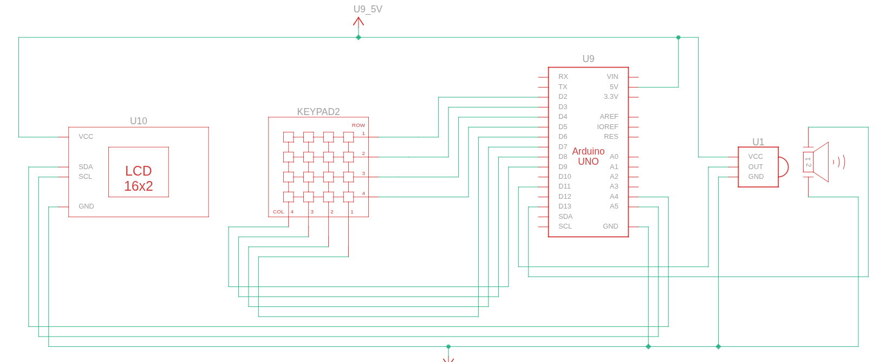

# What is CalcDuino?
Hi, it is an arduino based calculator which is very cool as it also offers a way to interact wirelessly lol and a 4x4 keypad too.

## How to use it??
its as simple as a normal calculator, see for the keypad:
- 0-9 : are digits
- A - +
- B - -
- C - *
- D - /
- \* - clear 
- \# - equals
## Why i made this??
i made this because i wanted to learn programming, and whats better way to learn rather than building. plus its a cool calculator.

# schematic:


# How to try??
1. Run this in your terminal:
```
git clone https://github.com/aryan-git-byte/calcduino
cd calcduino
code .
```
2. Now install Wokwi extension and get its license key by signing up
3. run this(you'll may have to install arduino cli and libraries before this)
```
cd main
arduino-cli compile --fqbn arduino:avr:uno --output-dir ./build .
```
